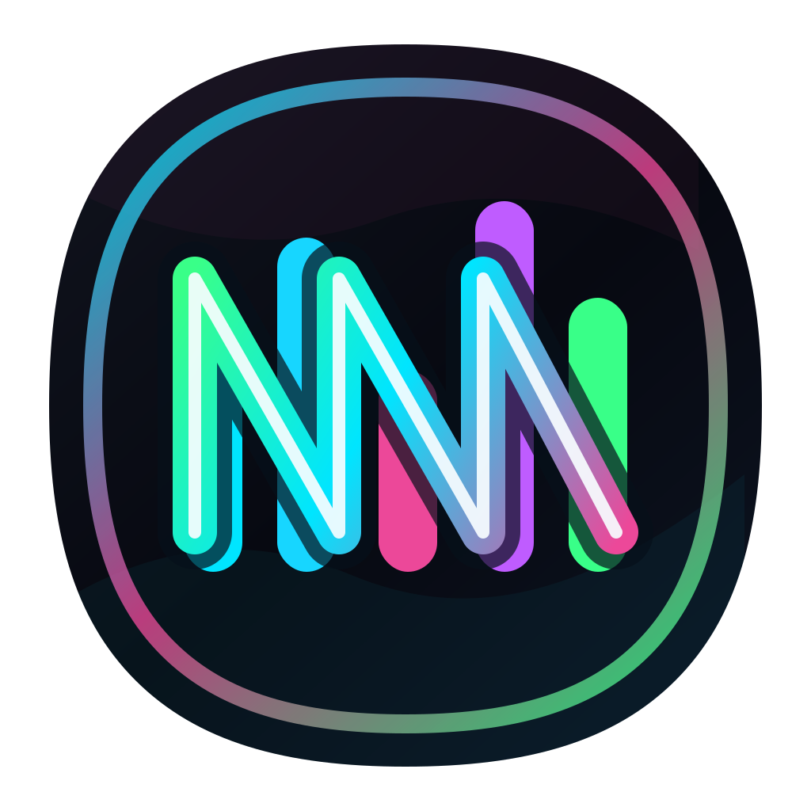
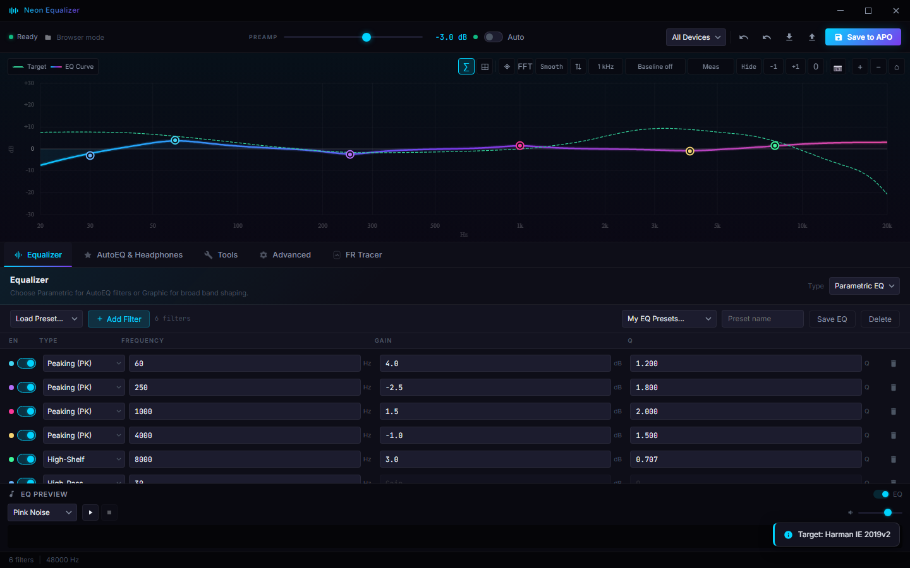

<div align="center">
  
  <h1>Neon Equalizer</h1>
  <p>A modern Windows desktop GUI for <a href="https://sourceforge.net/projects/equalizerapo/">Equalizer APO</a> — parametric EQ, AutoEQ headphone targets, Squiglink measurements, VST plugins, GraphicEQ, and more.</p>

  <p>
    <a href="https://github.com/IJustItay/Neon-Equalizer/releases/latest">
      
    </a>
    <a href="https://github.com/IJustItay/Neon-Equalizer/releases">
      
    </a>
    <a href="https://github.com/IJustItay/Neon-Equalizer/releases/latest">
      
    </a>
    
  </p>

  <p>
    <a href="#-quick-start">Quick Start</a> ·
    <a href="#-download">Download</a> ·
    <a href="#-features">Features</a> ·
    <a href="#-screenshots">Screenshots</a> ·
    <a href="#-build-from-source">Build</a>
  </p>
</div>

---



---

## ⚡ Quick Start

Neon Equalizer requires [**Equalizer APO**](https://sourceforge.net/projects/equalizerapo/) to be installed first.

1. **Install Equalizer APO** and select your playback device during setup.
2. **[Download Neon Equalizer](#-download)** — portable or installer.
3. **Run `Neon Equalizer.exe`** — it auto-detects your APO config folder.
4. Add filters, load a target, preview the result, then click **Save to APO**.

> The app requests administrator permission because Equalizer APO stores its config in `Program Files`.

---

## 📥 Download

| Build | Size | Notes |
|-------|------|-------|
| [**Portable .exe**](https://github.com/IJustItay/Neon-Equalizer/releases/latest) | ~120 MB | No install needed — just run |
| [**Installer (Setup)**](https://github.com/IJustItay/Neon-Equalizer/releases/latest) | ~120 MB | Adds Start Menu shortcut, supports auto-update |

> **Auto-updates:** The installer build checks for new releases on startup and can download + install updates from within the app.

---

## ✨ Features

### Equalizer
- **Parametric EQ** with a real-time draggable frequency-response graph
- **Graphic EQ** with custom band frequencies and vertical sliders
- Per-filter enable/disable toggles, color coding, channel routing (L / R / all)
- Up to 31 bands, undo/redo stack, auto-preamp with clipping protection
- EQ snapshots — save A/B states and switch instantly; auto-snapshots every 8 s

### AutoEQ & Headphone Targets
- Search **AutoEQ** headphone measurements database
- Browse **Squiglink** for measurements and targets with an embedded viewer
- FR Tracer — upload or trace a headphone frequency-response image to extract data
- Adjustable bass shelf, treble shelf, and overall tilt before running the optimizer
- Auto-generate parametric filters matching any target curve

### Import / Export
- Import from: APO Config, Squig PEQ text, Wavelet GraphicEQ, JamesDSP
- Export to: APO Config, Squig PEQ, Wavelet, JamesDSP, Poweramp XML

### Tools
- **VST plugin** entries — chain `.dll` effects in Equalizer APO
- **Convolution** — drop-in impulse response files (`.wav`, `.flac`, `.ir`)
- **Loudness Correction** — reference level, offset, and attenuation controls
- **Channel routing** — copy, delay, and mix channels
- **Hardware PEQ transfer** — push filters to USB/network devices (HID PEQ)
- **Live audio preview** — pink noise, white noise, or your own audio file with EQ on/off toggle

### Interface
- Dark and light themes, switchable in one click
- **UI zoom** — scale the entire interface from 80 % to 125 % (or `Ctrl +` / `Ctrl −`)
- Keyboard shortcuts: `Ctrl+S` save, `Ctrl+Z` / `Ctrl+Y` undo/redo
- Persistent device profiles per audio output
- Presets, Quick Load/Delete, raw APO config editor, expression editor
- Auto-detect Equalizer APO config path

---

## 🖥️ System Requirements

| | Minimum |
|---|---|
| OS | Windows 10 64-bit |
| Software | [Equalizer APO](https://sourceforge.net/projects/equalizerapo/) installed |
| RAM | 150 MB free |
| Display | 1280 × 720 |

---

## 🔨 Build From Source

**Requirements:** Node.js 20+, Windows 10+

```powershell
# Clone and install
git clone https://github.com/IJustItay/Neon-Equalizer.git
cd Neon-Equalizer
npm install

# Run in development (Vite + Electron)
npm run dev

# Generate icon assets
npm run icons

# Build distributable exe
npm run dist
```

Output files are written to `release/`.

---

## 💾 User Data & Backups

Go to **About → User Data → Save Backup** to export all presets, device profiles, EQ snapshots, A/B slots, and local settings to a `.zip` file. Use **Restore Backup** to bring them back — the app creates a safety backup first and restarts after restore.

---

## 📁 Repository Structure

```
assets/          App icons (generated from icon.svg)
docs/images/     README screenshots
electron/        Desktop shell, file dialogs, IPC, tray
public/targets/  Bundled EQ target curves
scripts/         Build helpers
src/             App UI and EQ logic
  components/    FrequencyGraph, ParametricEQ, TargetAdjustments
  config/        APO config parser and serializer
  main.js        App entry point
```

---

## 📄 License

This project is licensed under the repository license.  
Built with [Electron](https://www.electronjs.org/), [Vite](https://vitejs.dev/), and vanilla JavaScript.
